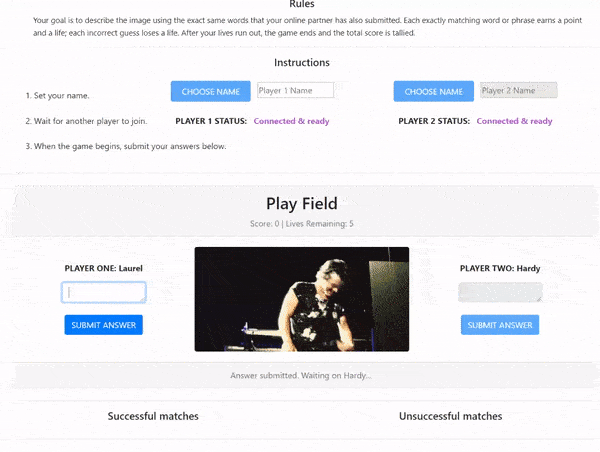

# multiplayer-image-labeler-game
A 2-player game based on the original Google Image labeler concept, using GIFs via the GIPHY API instead. 

# tech
Firebase, Bootstrap, jQuery, AJAX

# goals
Instead of making a rock-paper-scissors app for my first attempt at online multiplayer, I wanted to recreate on a small scale the old Google Image Labeler. Accordingly, this is a full-stack cooperative multiplayer game that challenges each player to submit matching words when presented with a random GIF from the GIPHY API. 

# try it yourself!
To play, make sure both players have each opened the link or refreshed the page before entering their names. Currently, each page refresh resets the realtime database. https://jwkeena.github.io/multiplayer-image-labeler-game/

